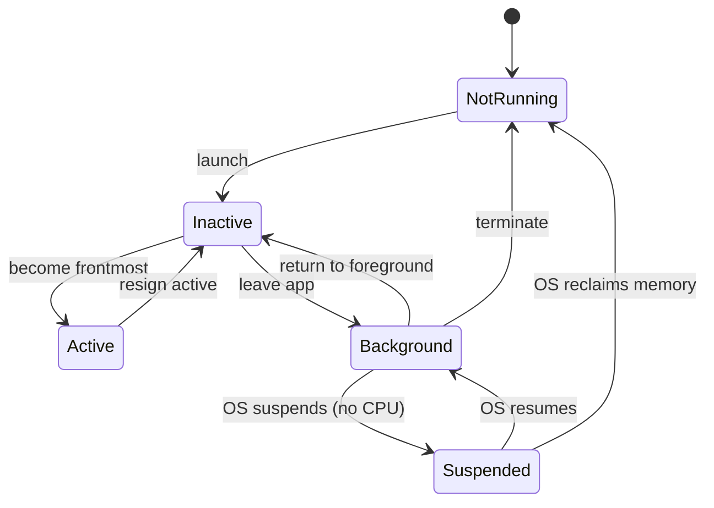
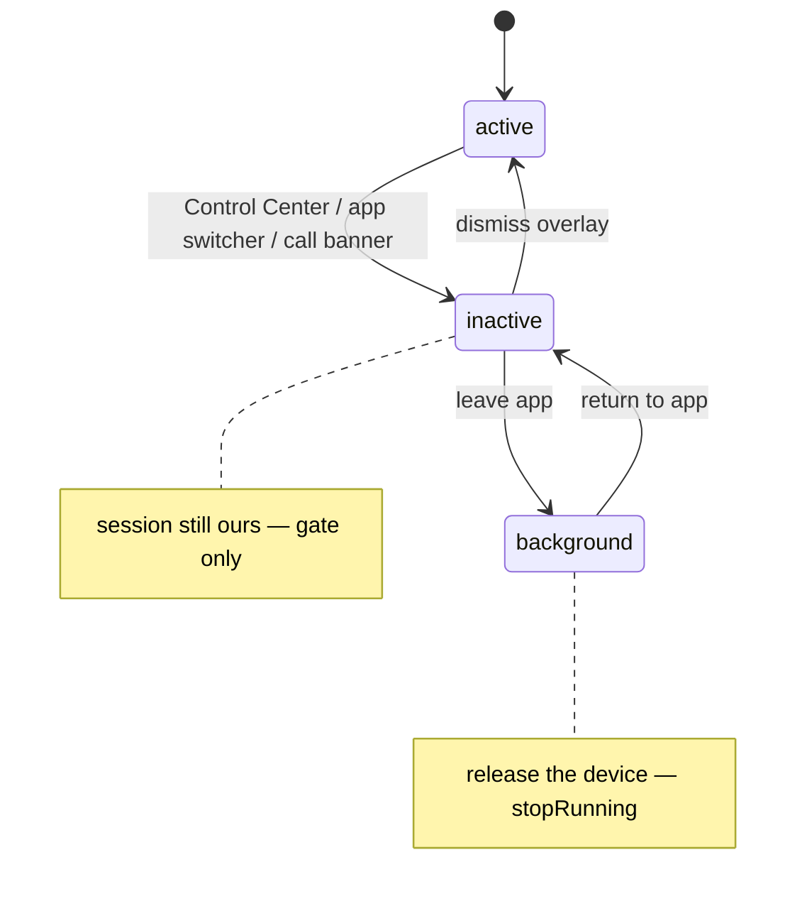
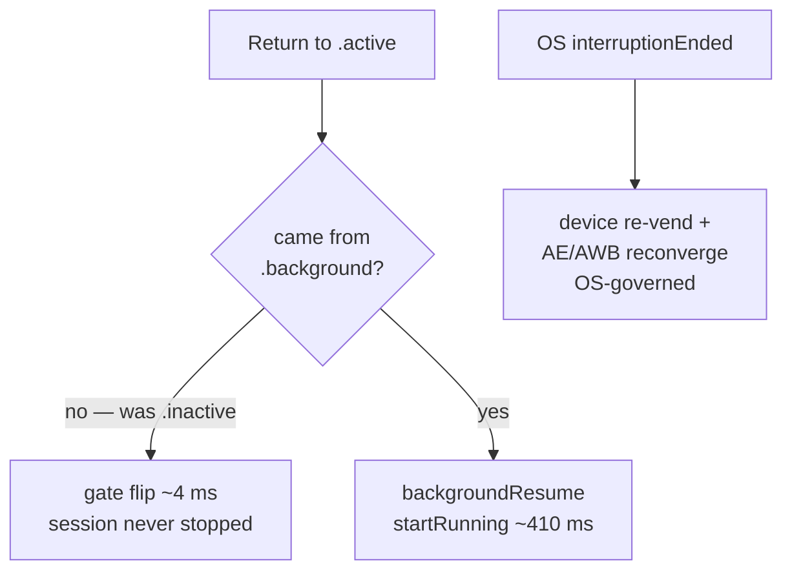
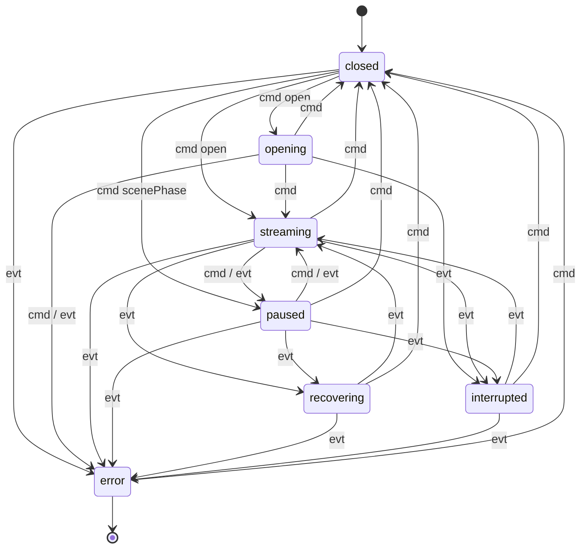
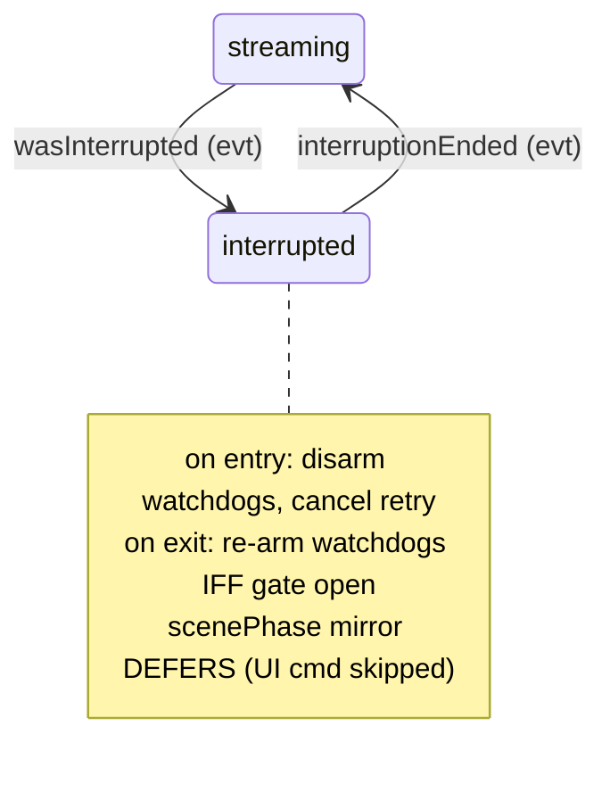
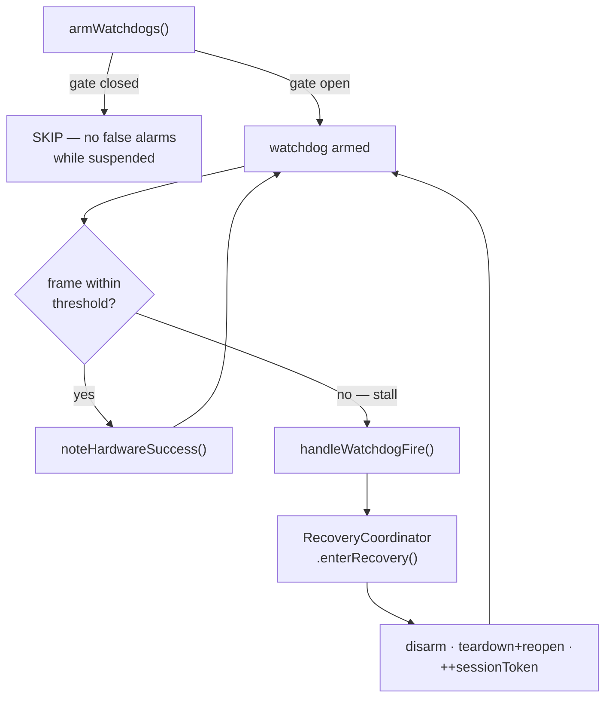

# Handling the iOS Camera Lifecycle

**Audience:** anyone working with the iOS camera lifecycle — CameraKit
maintainers, cam2fd / Flutter integrators, or external iOS developers building a
capture app. **Scope:** the specific intersection of *the iOS app lifecycle*,
*AVCaptureSession device interruptions*, and *a GPU preview/render loop* on
iOS 26. It is **not** a general iOS app-lifecycle reference — it documents the
camera-specific corner of it, the part that bites.

Everything here is grounded in CameraKit's implementation with `file:line`
anchors, and in the on-device bugs we hit shipping it. Read the
[bug catalog](#6-the-bug-catalog) first if you just want the "don't do this"
list.

---

## 1. The iOS app lifecycle and its events

Before the camera-specific part, the foundation: **iOS owns your app's execution
state**, and moves it through a state machine you observe but do not control. A
camera app then sits *under a second* state machine (the capture device) — but
that is [§2](#2-the-one-idea-that-explains-every-bug-two-lifecycles). First, the
generic one.

### 1a. The OS execution states

Every iOS app moves through these states, driven by the system (UIKit's
`UIApplication` / scene model underneath; the same states whether you use UIKit
or SwiftUI):



| State | Meaning | Camera implication |
|---|---|---|
| **Not running** | Not launched, or terminated | Nothing held |
| **Inactive** | Foreground but **not receiving events** — a transient overlay (Control Center, an incoming-call banner, the app switcher) is up | UI occluded, but the app is still foreground and the capture device is **still ours** |
| **Active** | Foreground and interactive | Frames should be visible |
| **Background** | Off-screen, briefly running code (you get seconds to wind down) | Must release the capture device |
| **Suspended** | In memory but **frozen** — no code runs; the OS can reclaim it any time | Everything already released; no code to react |

The single most important distinction for a camera app: **Inactive is not
Background.** A transient overlay (Control Center) drops you to *Inactive* with
the device still bound; only *leaving* the app reaches *Background* where the
device must go. Conflating them is the source of the latency bug in
[§3](#3-the-three-resume-paths-and-why-control-center-feels-slow).

### 1b. SwiftUI `scenePhase` — the app-facing projection

SwiftUI collapses the OS states into a 3-value `@Environment(\.scenePhase)`. This
is what application code actually observes:



| `ScenePhase` | Maps to OS state | What it means for the camera |
|---|---|---|
| `.active` | Active | Frames should be visible |
| `.inactive` | Inactive | UI occluded, device still ours — pause cheaply, **don't** tear down |
| `.background` | Background (→ Suspended) | Release the capture device |

Note SwiftUI does not surface *Suspended* or *Not running* as a `scenePhase` —
your last chance to run code is the `.background` transition. Everything that
must happen before suspension (finalize a recording, release the device) has to
happen there.

### 1c. The events you actually handle

Two families of events drive a camera app. Keep them separate in your head —
[§2](#2-the-one-idea-that-explains-every-bug-two-lifecycles) explains why.

**App-lifecycle events (you observe `scenePhase`):**

| Event | Triggered by |
|---|---|
| → `.inactive` | Control Center, Notification Center, app-switcher peek, incoming-call banner |
| → `.background` | User leaves the app (home, switch apps, lock) |
| → `.active` | App returns to foreground / overlay dismissed |

**Device-lifecycle events (AVFoundation notifications, OS-initiated):**

| Notification | Meaning (`AVCaptureSession.InterruptionReason`) |
|---|---|
| `wasInterrupted` | OS took the device — backgrounding, another client, multiple foreground apps, audio contention, or system (thermal) pressure |
| `interruptionEnded` | The interruption cleared; the device may be available again |
| `runtimeError` | The session failed mid-run (recoverable or not) |

The device-lifecycle events arrive **asynchronously, on the OS's schedule**, and
are *not* synchronized with your `scenePhase` transitions. That asynchrony is the
whole problem.

---

## 2. The one idea that explains every bug: two lifecycles

A camera app is driven by **two independent, concurrent state machines**:

1. **The app lifecycle** ([§1](#1-the-ios-app-lifecycle-and-its-events)) —
   host-driven, observed via `scenePhase`, predictable.
2. **The capture-device lifecycle** — OS-driven `AVCaptureSession` interruptions,
   asynchronous, surfaced in CameraKit as `CameraSession.SessionEvent` and
   handled in `CameraEngine.onSessionEvent` (`CameraEngine.swift:1837`).

Almost every lifecycle bug comes from treating these as one. They **race**: the
OS fires interruption events interleaved with your scenePhase transitions, in
orderings that are not fully enumerable. The OS will, for example, fire a device
interruption *and* a `.background` scenePhase change on the same backgrounding —
two events, two systems, no guaranteed order.

A correct camera app must:

1. Handle each system on its own terms, and
2. Decide, when they conflict, **which one is authoritative** — the OS device
   state always wins (see [§5c](#5c-the-os-is-authoritative)).

[Bugs 1, 2, and 3](#6-the-bug-catalog) are all the same shape: code that assumed
one system implied the other.

---

## 3. The three resume paths (and why Control Center *feels* slow)

Because `.inactive` ≠ `.background`, returning to `.active` is not one operation
— it is one of three, with very different costs. These are real measurements
from the device log (iPad Pro, iOS 26.4):



| Path | Trigger | What we do | Cost |
|---|---|---|---|
| **Gate flip** | `.inactive` → `.active` (Control Center, app-switcher peek) | reopen the GPU submission gate; **session never stopped** | **~4 ms** (`07:42:37.330 → .334`) |
| **Session restart** | `.background` → `.active` | `startRunning()` the session stopped on suspend | **~410 ms** (`07:42:30.910 → 31.321`) |
| **Device re-vend** | OS interruption ends | OS re-acquires the device, AE/AWB re-converges | variable, OS-governed |

**The Control Center latency puzzle.** Users reported Control Center
open/dismiss *felt* slower (~1 s) than a full background swipe (~300 ms) — the
opposite of what the cost table predicts. The logs settled it: Control Center is
the **cheapest** path (a 4 ms gate flip, *no* interruption event at all). The
perceived ~1 s is the **iOS Control Center dismiss animation** — the system shows
a static app snapshot during the slide-away, and the live feed only reappears
after that transition completes. **None of it is engine latency.** The lesson:
measure the actual path before "optimizing" perceived latency; the bottleneck was
in the OS compositor, not our code.

This three-way split only works because of the [submission gate](#5a-the-gate)
and the `cameFromBackground` flag (`ViewModel.swift:84`): `backgroundResume()`
(the expensive `startRunning`) fires **only** when returning from `.background`
(`ViewModel.swift:341`), never from `.inactive`. Get that flag wrong and every
Control Center dismiss pays the 410 ms session-restart cost for nothing.

---

## 4. The scenePhase → engine mapping

The app's `ViewModel.handleScenePhase(_:)` (`ViewModel.swift:321`) is the single
place scenePhase is translated into engine calls. It encodes the
[§1](#1-the-ios-app-lifecycle-and-its-events) distinction directly:

```
.inactive   → setGate(false) → drainSubmittedFrame() → notifyScenePhasePaused(true)
              (gate only; session keeps running)              ViewModel.swift:326

.background → backgroundSuspend() → notifyScenePhasePaused(true)              ViewModel.swift:333
              backgroundSuspend = gate-close → disarm watchdogs + cancel retry
                                → finalize recording → drain → stopRunning    CameraEngine.swift:763

.active     → [if cameFromBackground] backgroundResume() → setGate(true)
              → notifyScenePhasePaused(false)                                 ViewModel.swift:340
```

Three things to note:

- **`.inactive` does NOT stop the session.** It only closes the gate
  (`setGate(false)`) and drains the last in-flight frame. This is what makes the
  4 ms resume possible.
- **`.background` does a lot more than stop the session.** Inside
  `backgroundSuspend()` (`CameraEngine.swift:763`) the order matters: gate-close
  (`:765`) → **disarm watchdogs + cancel any pending retry** (`:766`) → finalize
  any active recording (`:768`) → drain (`:773`) → `stopRunning` (`:774`). The
  disarm step is the pre-emptive twin of **Bug 1**'s disarm-on-interruption:
  we are about to stop frames *on purpose*, so the stall detectors must go quiet
  first. Finalizing the recording before the drain/stop is what keeps the `.mp4`
  from being left corrupt — see
  [§5e](#5e-finalize-recordings-before-the-os-suspends-you).
- **The explicit `setGate(true)` on `.active` is a deliberate reaffirmation, not
  a bug.** When returning from `.background`, `backgroundResume()` already opens
  the gate (`CameraEngine.swift:789`); the following `setGate(true)` is a no-op in
  that path. It is load-bearing only for the `.inactive → .active` path (where
  `backgroundResume()` is skipped because `cameFromBackground` is false). One call
  covers both resume paths.

---

## 5. The architecture that makes it safe

Six primitives carry the lifecycle.

### 5a. The gate

The **submission gate** (`setGate(_:)` at `CameraEngine.swift:1662`; ADR-09 /
D-06) is a single atomic boolean that decouples *"the session is running"* from
*"frames are committed to the GPU."* Every `commandBuffer.commit()` checks it.

This decoupling is the whole game. For a transient `.inactive` pause we don't
tear down the expensive `AVCaptureSession` — we just stop *committing* frames.
The session keeps the device warm, AE/AWB stays converged, and resume is a single
atomic store. We pay the heavyweight `stopRunning`/`startRunning` only for true
`.background`.

### 5b. The state machine (observability-first, not a gate)

`SessionStateMachine` (`SessionStateMachine.swift`) tracks `SessionState` and
classifies every transition as `.expected` or `.offMap`
(`classify` at `SessionStateMachine.swift:67`). The **entire** state machine —
every state and every edge from the command and event maps — is below.



**Legend.** `cmd` = a **command** (host-initiated or engine-self-commanded —
open/close/pause, the scenePhase mirror; strict, `commandMap` at
`SessionStateMachine.swift:114`). `evt` = an **event** (OS-initiated via
AVCaptureSession notifications; permissive, `eventMap` at
`SessionStateMachine.swift:127`). The event map is permissive *on purpose*: the
OS event space is not fully enumerable, so an event can legitimately arrive from
many states. Self-transitions (re-affirm the same state) are always expected and
omitted from the diagram.

The defining policy (`SessionStateMachine.swift:27`): **any transition not in
those maps is "off-map" — and off-map is LOGGED, then APPLIED, in every build
config.** The state machine is a *diagnostic instrument, not a gate*. It does not
reject transitions; it records the anomaly and moves on. (This was not always
true — see **Bug 5**.) Off-map edges are deliberately absent from the diagram:
they are anomalies to investigate via the log, not part of the contract.

### 5c. The OS is authoritative

When `cmd` and `evt` conflict, **the event wins.** A host UI command must never
overwrite OS-owned state. The OS-driven interruption sub-machine and its guard:



This is enforced in `notifyScenePhasePaused(_:)` (`CameraEngine.swift:561`): if
the engine is in an OS-owned state (`.interrupted`, `.recovering`, `.error`) the
scenePhase mirror *defers* — it skips its own publish and lets the OS event path
restore `.streaming`. The log line `[scenePhase] skipping mirror ... (deferring
to OS-driven state)` is this guard working, not an error. (**Bug 2** was the
absence of this guard.)

### 5d. Stall watchdogs gated on the same signal as frames

Two stall watchdogs (GPU 3000 ms, capture 5000 ms) drive a `RecoveryCoordinator`
that tears down and reopens the session if frames stop arriving. The mechanism,
including the gate-guard that prevents false alarms while suspended:



The hard rule learned the hard way ([Bugs 1 & 3](#6-the-bug-catalog)): **anything
that fires when "frames should be flowing but aren't" must be armed/disarmed on
the same signal that gates frames.** `armWatchdogs()`
(`CameraEngine.swift:1734`) is therefore gate-guarded — it refuses to arm while
the submission gate is closed. A backgrounded session has no frames *by design*;
a watchdog that fires there is a false alarm that drives a spurious recovery.

### 5e. Finalize recordings before the OS suspends you

`backgroundSuspend()` finalizes any in-flight recording via a background-task
drain *before* calling `stopRunning` (`CameraEngine.swift:768`). If you stop the
session (or let the OS suspend you) with the `AVAssetWriter` still open, the
`.mp4` is left unfinalized and **corrupt**. This is a lifecycle gotcha that never
bit us only because it was built in from the start — but it is the first thing to
break if someone "simplifies" the suspend path.

### 5f. Cross-isolation handoff cells (`Mailbox`)

The capture/delivery queue produces textures; the main-thread render loop
consumes them. They live in different isolation domains and run concurrently. The
handoff goes through `Mailbox<T>` (`Mailbox.swift`), whose `store` / `latest`
(`Mailbox.swift:53`, `:63`) are serialized by an `OSAllocatedUnfairLock`
(`Mailbox.swift:43`). Unsynchronized, the reader's ARC retain races the writer's
release of the same reference → over-release → crash (**Bug 4**).

---

## 6. The bug catalog

Every entry: **Symptom → Root cause → Fix → Lesson.** All five are lifecycle
bugs found on-device (measurements 2026-05-20 §1).

### Bug 1 — watchdog fires *during* an OS interruption

- **Symptom:** Backgrounding the app (or a phone call) crashed it in DEBUG with
  `assertionFailure("off-map SessionState transition")`,
  `interrupted → recovering (event)`.
- **Root cause:** The OS interrupts the `AVCaptureSession` on background and stops
  frame delivery. The stall watchdog was still armed, saw no frames, and fired —
  driving `interrupted → recovering`, an off-map transition.
- **Fix:** Disarm the watchdogs and cancel any pending retry the moment the
  interruption arrives, in `onSessionEvent`'s `.otherInterruption` case
  (`CameraEngine.swift:1856`), mirroring the `.cameraInUseBegan` path.
- **Lesson:** When the OS legitimately stops frames, a stall is not a fault.
  Silence the fault detectors on entry to every OS-owned no-frames state.

### Bug 2 — a UI command overwrites OS-owned state

- **Symptom:** A second crash on background: `recovering → streaming (command)`
  from `notifyScenePhasePaused(_:)`. The engine's *own* scenePhase observer tried
  to force `.streaming` while the OS had the engine in `.recovering`/
  `.interrupted`.
- **Root cause:** The engine has its own scenePhase mirror *in addition to*
  whatever the host app does. On return to `.active` it published
  `.streaming (command)` unconditionally — illegal from an OS-owned state, and
  worse, it would have overwritten the OS's truth with a wrong value.
- **Fix:** The scenePhase mirror now classifies its own transition first and
  **defers** when the origin is OS-owned (`notifyScenePhasePaused` guard,
  `CameraEngine.swift:561`); the OS event path restores `.streaming`.
- **Lesson:** [The OS is authoritative](#5c-the-os-is-authoritative). A
  host/UI-initiated command must never overwrite a state the OS owns. Validate
  every self-issued transition against the same classifier.

### Bug 3 — interruption *ends* while still backgrounded, re-arms the watchdog

- **Symptom:** After Bugs 1 & 2 were fixed, a *third* background crash, same
  off-map signature `interrupted → recovering`, ~9 s after backgrounding.
- **Root cause:** On background, `stopRunning` triggers an OS interruption whose
  `.otherInterruptionEnded` fires **while the app is still backgrounded**. That
  handler re-armed the watchdog unconditionally (`CameraEngine.swift:1870`). With
  the gate closed and no frames flowing, the re-armed watchdog fired ~9 s later →
  spurious recovery → off-map crash.
- **Fix:** Gate-guard `armWatchdogs()` (`CameraEngine.swift:1734`): it refuses to
  arm while the submission gate is closed. Confirmed in the log as `[watchdog]
  arm skipped — submission gate closed` (`07:42:40.604`). `open()` and
  `backgroundResume()` both open the gate *before* arming, so legitimate paths are
  unaffected.
- **Lesson:** "Re-arm when the interruption ends" is wrong if the interruption
  can end while you are still suspended. Arm fault detectors on the signal that
  says *frames are actually flowing* (the gate), not on a lifecycle event that
  merely *implies* they should be.

### Bug 4 — render loop races the capture queue over a shared texture

- **Symptom:** `EXC_BAD_ACCESS` (pointer-authentication trap) in
  `Mailbox.latest.getter` during background/recovery — intermittent, no clean
  repro.
- **Root cause:** The MTKView draw loop reads the lane-texture `Mailbox` on the
  main thread while the capture/delivery queue writes it. An unsynchronized
  `var _value: T?` raced the reader's ARC retain against the writer's release of
  the same reference → over-release. The render loop kept running through the
  `.inactive`/`.background` transition, widening the window.
- **Fix:** Two layers. (1) Serialize `Mailbox.store`/`latest` with an
  `OSAllocatedUnfairLock` (`Mailbox.swift:43`) so retain/release happen under the
  lock. (2) Pause the draw loop when not active: `MTKViewRepresentable.isPaused =
  scenePhase != .active` (`CameraView.swift:647`, applied at `:111`, `:116`,
  `:539`) — don't render a camera preview while suspended anyway.
- **Lesson:** Two independent layers, and they are not interchangeable. The
  **lock is the fix** — it is what actually makes concurrent read/write of the
  shared cell safe, and it is sufficient on its own. Pausing the render loop on
  non-`.active` scenePhase only *narrows the window*; it is defense-in-depth (and
  a power win), not a substitute for the lock. Don't reach for "I'll just pause
  the loop" and skip the lock — the race still exists in any window you leave
  open.

### Bug 5 — the DEBUG tripwire amplified bugs instead of catching them

- **Symptom:** Every lifecycle race above manifested as a hard *crash* in DEBUG
  (`assertionFailure` on off-map), while RELEASE handled the same transition
  gracefully (log + apply). On-device DEBUG testing became a minefield, and the
  DEBUG/RELEASE divergence masked which anomalies were actually harmful.
- **Root cause:** `publishState` tripped `assertionFailure(...)` on any off-map
  transition in DEBUG. But the OS event space is not fully enumerable, so
  *legitimate-but-rare* OS orderings (an interruption ending while backgrounded)
  also aborted the app.
- **Fix:** Drop the DEBUG `assertionFailure` entirely. Off-map now behaves
  identically in all configs: **log with full context, then apply**
  (`publishState`, `CameraEngine.swift:1681`; policy at
  `SessionStateMachine.swift:27`). Real state-logic regressions are caught by the
  classifier *unit tests*, not by aborting a running app.
- **Lesson:** For a state machine fed by an adversarial, non-enumerable event
  source (the OS), prefer **observability over hard-failure**. Crash-on-anomaly
  only makes sense when the anomaly set is closed and owned by you. The log is the
  diagnostic; the tests are the gate.

---

## 7. Design tradeoffs we *accepted* (not bugs)

Lifecycle correctness is not "drive every anomaly to zero." Some are logged,
measured, and deliberately left.

- **Truthfulness gap on background-ending interruptions** (`CameraEngine.swift:556`).
  If an interruption ends while the app is backgrounded, the OS publishes
  `.streaming (event)` but the host won't re-issue `notifyScenePhasePaused(true)`
  until the next scenePhase change — so `SessionState` briefly reads `.streaming`
  while the gate is still closed. We decided this is a *truthfulness gap, not a
  crash*: the gate (D-06) owns correctness, frames stay gated, and the next
  scenePhase event reconciles the label. Documented and left.
- **Control Center perceived latency**
  ([§3](#3-the-three-resume-paths-and-why-control-center-feels-slow)).
  The ~1 s is the OS dismiss animation, not our resume. Nothing to fix on our
  side; we chose not to add machinery to fight a system compositor animation.

The point: a mature lifecycle has a short, *explicit* list of accepted gaps, each
with a reason. That list is part of the design, not a backlog.

---

## 8. Checklist for any iOS camera-lifecycle code

1. **Model two lifecycles, not one.** scenePhase (app) and AVCaptureSession
   interruptions (device) are independent and concurrent. Never assume one implies
   the other.
2. **`.inactive` is not `.background`.** Gate (don't stop) for transient pauses;
   stop the session only for true background. Track which one you're resuming from
   (`cameFromBackground`) so you don't pay restart cost on every Control Center
   dismiss.
3. **The OS device state is authoritative.** A UI/host command must never
   overwrite an OS-owned state (`.interrupted`/`.recovering`/`.error`). Classify
   self-issued transitions and defer when the OS owns the origin.
4. **Gate your fault detectors on the frame signal.** Watchdogs / stall
   detectors must arm/disarm on the same gate that controls frame flow — not on
   lifecycle events that merely imply frames *should* flow. Interruptions can end
   while you're still suspended.
5. **Lock cross-isolation handoffs.** Any reference cell read by the render loop
   and written by the capture queue needs a lock or strict single-writer+atomic
   discipline.
6. **Pause the render loop when not `.active`.** Kills teardown races and saves
   power.
7. **Finalize recordings before suspend.** Close the `AVAssetWriter` in the
   background-suspend path or ship corrupt files.
8. **Log-and-apply over crash-on-anomaly** for OS-fed state machines. Catch real
   regressions in tests, not by aborting the app.

---

## 9. Quick reference: event → handler

| Event | Source | Handler | Action |
|---|---|---|---|
| `.inactive` | scenePhase | `ViewModel.swift:326` | gate close + drain |
| `.background` | scenePhase | `ViewModel.swift:333` → `backgroundSuspend()` `CameraEngine.swift:763` | gate close → disarm watchdogs + cancel retry → finalize recording → drain → `stopRunning` (in this order) |
| `.active` (from background) | scenePhase | `ViewModel.swift:340` → `backgroundResume()` `CameraEngine.swift:785` | gate open, `startRunning`, re-arm watchdogs |
| `.active` (from inactive) | scenePhase | `ViewModel.swift:340` | gate open only |
| `wasInterrupted` | AVF | `onSessionEvent` `.otherInterruption` `CameraEngine.swift:1856` | disarm watchdogs, cancel retry, `→ .interrupted` |
| `interruptionEnded` | AVF | `onSessionEvent` `.otherInterruptionEnded` `CameraEngine.swift:1870` | `→ .streaming`, re-arm watchdogs *iff gate open* |
| `videoDeviceInUseByAnotherClient` | AVF | `onSessionEvent` `.cameraInUseBegan` `CameraEngine.swift:1839` | disarm, fatal error, `→ .error` |
| `runtimeError` | AVF | `onSessionEvent` `.runtimeError` `CameraEngine.swift:1852` | `enterRecovery` |
| GPU/capture stall | watchdog | `RecoveryCoordinator` | teardown + reopen (only fires when gate open) |

---

## 10. For cam2fd / Flutter integrators

CameraKit owns the *device* lifecycle (interruptions, the gate, watchdogs,
recovery) — you don't re-implement any of it. Your job is the *app* lifecycle
half: the Flutter `AppLifecycleState` observer is your equivalent of
`ViewModel.handleScenePhase` (`ViewModel.swift:321`). Wire it the same way —
`paused`/`hidden` → suspend, `resumed` → resume — and forward those to the
plugin's engine bridge. Note that Flutter's `AppLifecycleState` is coarser than
SwiftUI's `scenePhase` (no clean `.inactive` vs `.background` split on all
versions), so when in doubt prefer the gate (cheap) over a full session stop, and
let the AVF interruption path (which CameraKit handles regardless) cover the
device-availability cases. The [§9](#9-quick-reference-event--handler) table is
your contract: every row already works through the plugin; you only have to
deliver the scenePhase rows.

---

*Grounded in CameraKit at the line anchors above. Bug evidence:
`measurements/phase-3-hitl/2026-05-20/notes.md`. Architecture anchors: ADR-02
(delivery queue), ADR-07 (sessionQueue), ADR-09 / D-06 (submission gate), D-13
(disarm-before-recovering), D-14 (terminal self-heal).*
