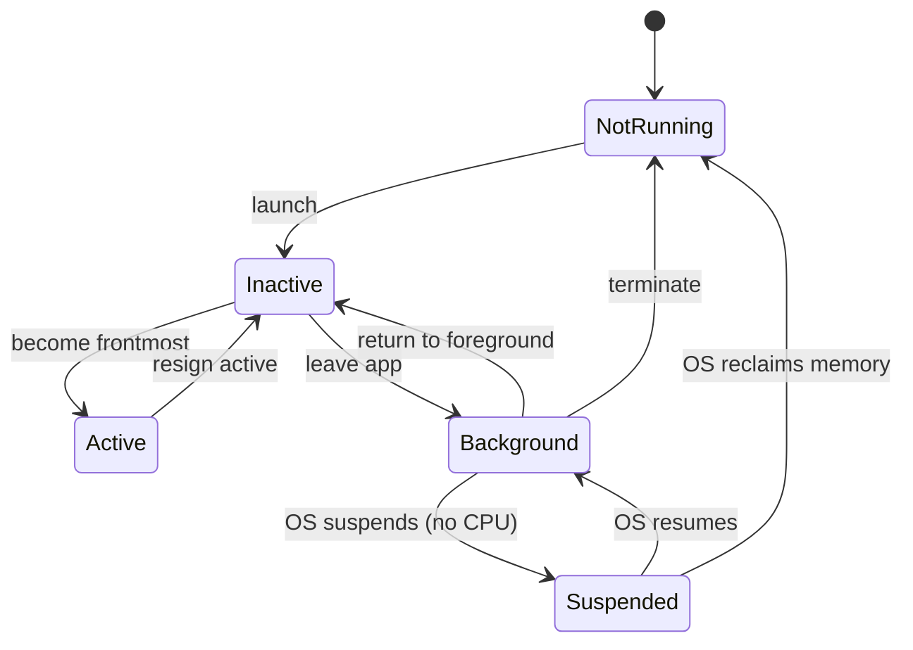
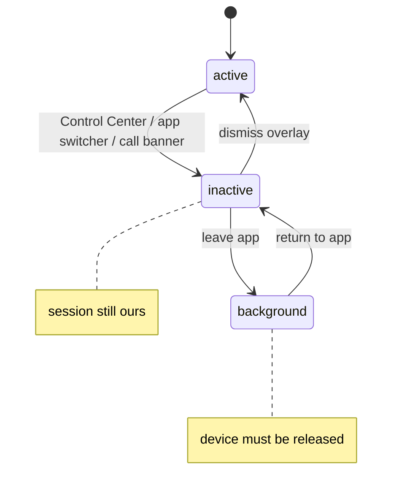
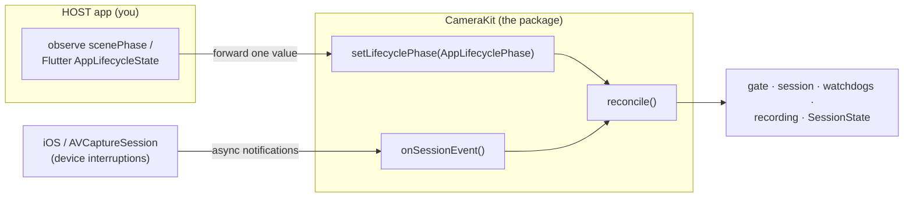
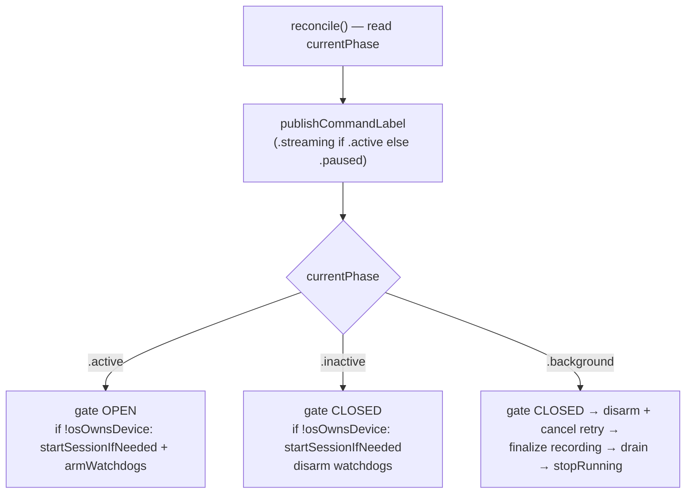
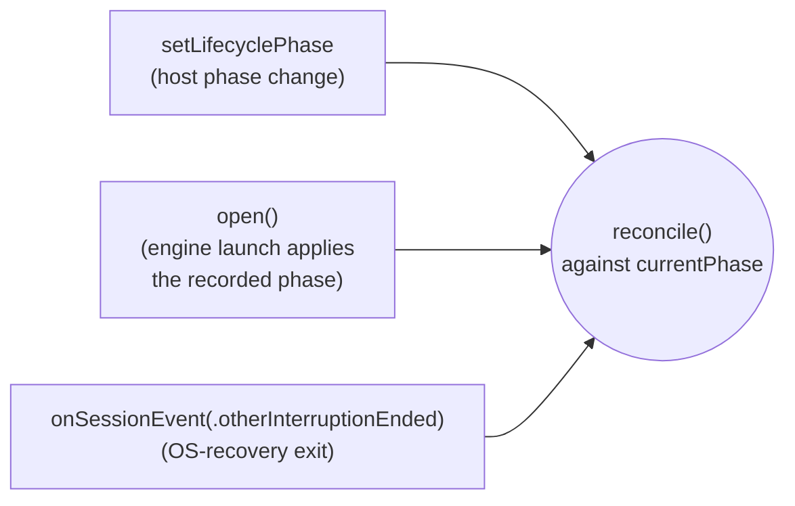
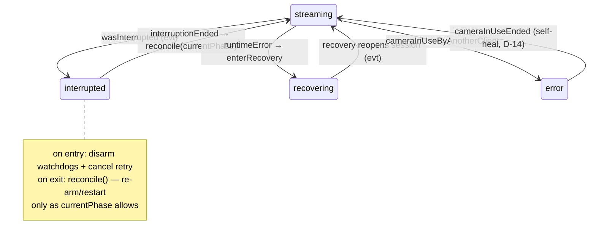
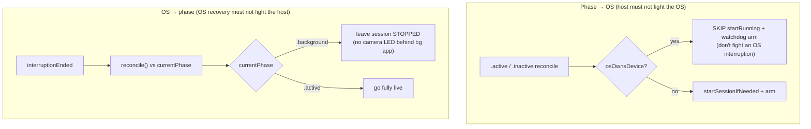
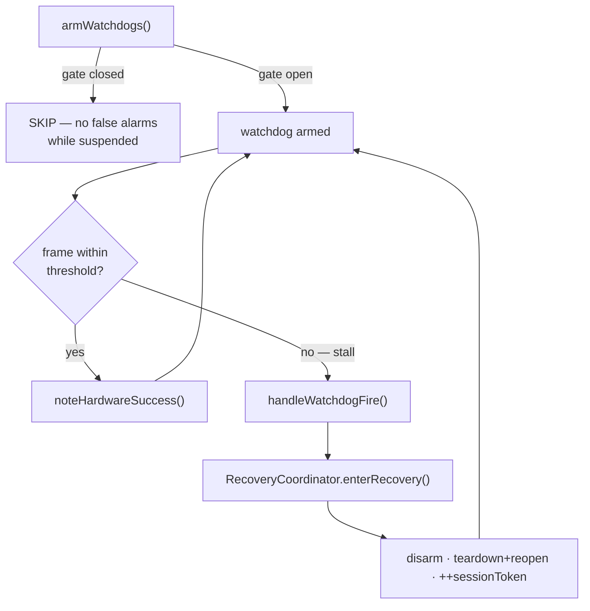
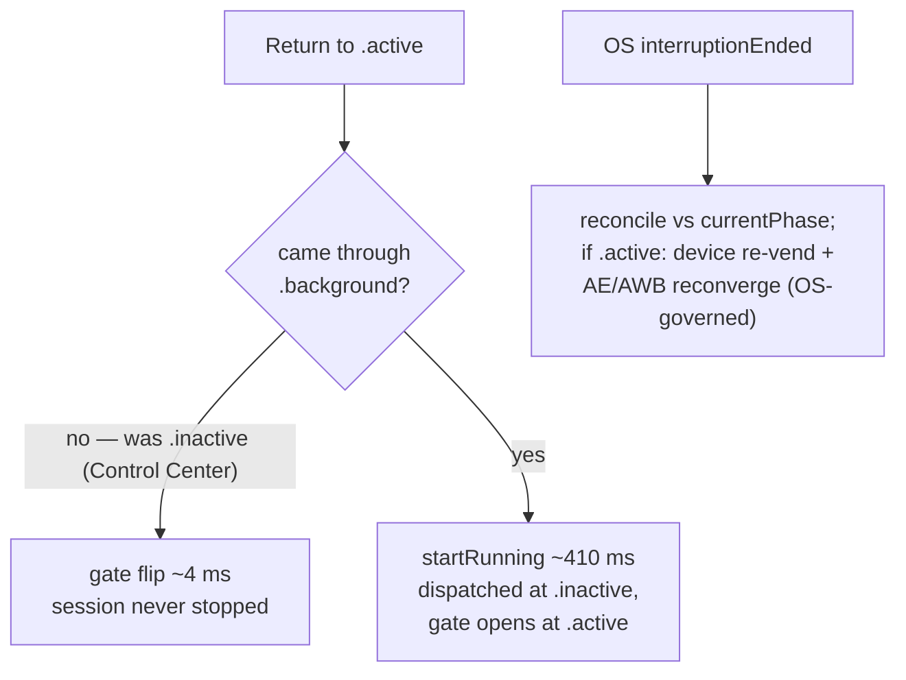
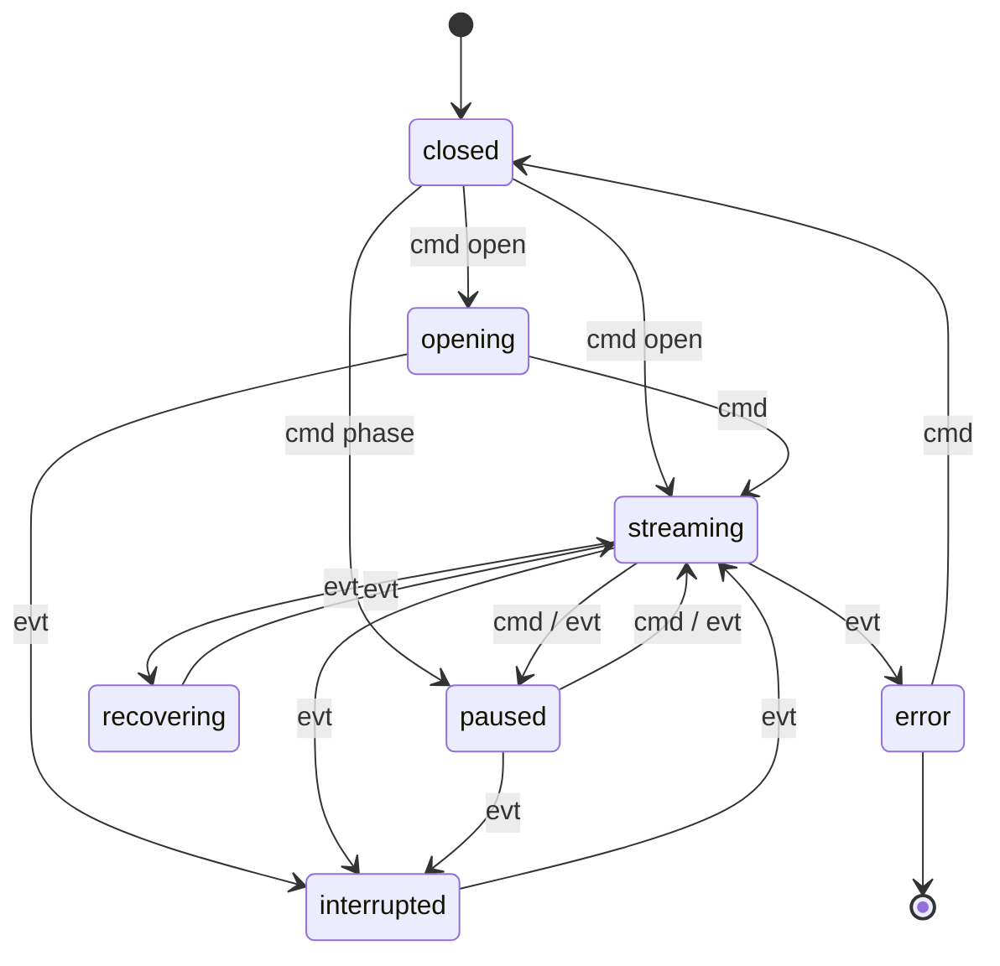

# Handling the iOS Camera Lifecycle

**Audience:** anyone working with the iOS camera lifecycle — CameraKit
maintainers, cam2fd / Flutter integrators, or external iOS developers building a
capture app. **Scope:** the specific intersection of *the iOS app lifecycle*,
*AVCaptureSession device interruptions*, and *a GPU preview/render loop* on
iOS 26. It is **not** a general iOS app-lifecycle reference — it documents the
camera-specific corner of it, the part that bites.

Everything here is grounded in CameraKit's implementation with `file:line`
anchors, and in the on-device bugs we hit shipping it. Read the
[bug catalog](#7-the-bug-catalog) first if you just want the "don't do this" list.

> **Ownership model (read this first).** The host app's *only* lifecycle job is to
> observe its app lifecycle and forward **one** value — the current
> `AppLifecyclePhase` — to `engine.setLifecyclePhase(_:)`. CameraKit owns
> everything downstream: the GPU gate, session start/stop, stall watchdogs,
> recording finalize, the device-interruption lifecycle, and the published
> `SessionState`. This is the result of the 2026-05 lifecycle-ownership rework;
> the host no longer drives the gate or calls suspend/resume directly. The two
> halves are [§3 (app lifecycle)](#3-app-lifecycle--how-camerakit-handles-it) and
> [§4 (device lifecycle)](#4-device-lifecycle--how-camerakit-handles-it).

---

## 1. The iOS app lifecycle (the generic foundation)

Before the camera-specific part: **iOS owns your app's execution state** and moves
it through a state machine you observe but do not control. This section is plain
iOS — no CameraKit. A camera app then sits *under a second* state machine (the
capture device); that is [§2](#2-two-lifecycles-two-owners).

### 1a. The OS execution states

Every iOS app moves through these states, driven by the system (UIKit's
`UIApplication` / scene model underneath; the same states whether you use UIKit
or SwiftUI):



| State | Meaning | Camera implication |
|---|---|---|
| **Not running** | Not launched, or terminated | Nothing held |
| **Inactive** | Foreground but **not receiving events** — a transient overlay (Control Center, an incoming-call banner, the app switcher) is up | UI occluded, but the app is still foreground and the capture device is **still ours** |
| **Active** | Foreground and interactive | Frames should be visible |
| **Background** | Off-screen, briefly running code (you get seconds to wind down) | Must release the capture device |
| **Suspended** | In memory but **frozen** — no code runs; the OS can reclaim it any time | Everything already released; no code to react |

The single most important distinction for a camera app: **Inactive is not
Background.** A transient overlay (Control Center) drops you to *Inactive* with
the device still bound; only *leaving* the app reaches *Background* where the
device must go. Conflating them is the source of the resume-cost confusion in
[§5](#5-the-three-resume-paths-and-why-control-center-feels-slow).

### 1b. SwiftUI `scenePhase` — the app-facing projection

SwiftUI collapses the OS states into a 3-value `@Environment(\.scenePhase)`. This
is what application code actually observes:



| `ScenePhase` | Maps to OS state | What it means for the camera |
|---|---|---|
| `.active` | Active | Frames should be visible |
| `.inactive` | Inactive | UI occluded, device still ours — pause cheaply, **don't** tear down |
| `.background` | Background (→ Suspended) | Release the capture device |

SwiftUI does not surface *Suspended* or *Not running* as a `scenePhase` — your
last chance to run code is the `.background` transition. Everything that must
happen before suspension (finalize a recording, release the device) has to happen
there. Note also that on a foreground→background→foreground round trip SwiftUI
emits the intermediate `background → inactive → active` — the resume passes
*through* `.inactive`, which matters in [§3b](#3b-the-packages-half-reconcile-to-the-phase).

### 1c. The two event families

Two families of events drive a camera app. Keep them separate in your head —
[§2](#2-two-lifecycles-two-owners) explains why.

**App-lifecycle events (the host observes `scenePhase`):**

| Event | Triggered by |
|---|---|
| → `.inactive` | Control Center, Notification Center, app-switcher peek, incoming-call banner |
| → `.background` | User leaves the app (home, switch apps, lock) |
| → `.active` | App returns to foreground / overlay dismissed |

**Device-lifecycle events (AVFoundation notifications, OS-initiated):**

| Notification | Meaning (`AVCaptureSession.InterruptionReason`) |
|---|---|
| `wasInterrupted` | OS took the device — backgrounding, another client, multiple foreground apps, audio contention, or system (thermal) pressure |
| `interruptionEnded` | The interruption cleared; the device may be available again |
| `runtimeError` | The session failed mid-run (recoverable or not) |

The device-lifecycle events arrive **asynchronously, on the OS's schedule**, and
are *not* synchronized with the `scenePhase` transitions. That asynchrony is the
whole problem.

---

## 2. Two lifecycles, two owners

A camera app is driven by **two independent, concurrent state machines**, and the
rework assigned each an explicit owner:



1. **The app lifecycle** ([§1](#1-the-ios-app-lifecycle-the-generic-foundation)) —
   host-driven, observed via `scenePhase`, predictable. The host's *entire*
   responsibility: map it to `AppLifecyclePhase` and call `setLifecyclePhase`.
2. **The capture-device lifecycle** — OS-driven `AVCaptureSession` interruptions,
   asynchronous, surfaced in CameraKit as `CameraSession.SessionEvent` and handled
   in `CameraEngine.onSessionEvent` (`CameraEngine.swift:1832`).

Both feed **one** reconciliation routine inside the package, so the package — not
the host — decides what the hardware does. Why the package does not observe the
app lifecycle itself: it imports no SwiftUI/UIKit (it ships into a Flutter plugin
and a native harness alike), and a library that grabbed lifecycle notifications
would fight its host. The host owns *observation*; the package owns *actuation*.

Almost every lifecycle bug comes from treating the two machines as one. They
**race**: the OS fires interruption events interleaved with `scenePhase`
transitions, in orderings that are not fully enumerable — e.g. a device
interruption *and* a `.background` `scenePhase` change on the same backgrounding,
two events, two systems, no guaranteed order. A correct camera app must (1) handle
each on its own terms and (2) decide, when they conflict, **which is
authoritative** — the OS device state always wins
([§4b](#4b-the-os-owned-guard-osownsdevice)). [Bugs 1, 2, 3](#7-the-bug-catalog)
are all the same shape: code that assumed one machine implied the other.

---

## 3. App lifecycle — how CameraKit handles it

### 3a. The host's half: observe and forward

The host observes its app lifecycle and forwards the current phase. That is the
*whole* host contract. The public type is a 3-case enum
(`SessionState.swift:21`):

```swift
public enum AppLifecyclePhase: Sendable {
    case active      // foreground & interactive
    case inactive    // visible but not receiving input (Control Center, call banner, app-switcher peek)
    case background  // not visible
}
```

The single API (`CameraEngine+Lifecycle.swift:130`):

```swift
public func setLifecyclePhase(_ phase: AppLifecyclePhase) async
```

It **never throws**, is safe to call **on every transition and before `open()`**,
and the **latest call wins** (a superseded, in-flight reconciliation is abandoned
— [§3d](#3d-latest-intent-wins)). In the native harness the entire host side is a
1:1 forward (`ViewModel.handleScenePhase`, `ViewModel.swift:318`):

```swift
func handleScenePhase(_ phase: ScenePhase) async {
    CameraKitLog.notice(.scenePhase, "scenePhase: \(prev) → \(next)")
    await engine.setLifecyclePhase(map(phase))   // map() at ViewModel.swift:332
}
```

`map(_:)` is identity over the three cases; an `@unknown default` (a future SwiftUI
case) maps to `.inactive` — the safe middle ground (gate closed, session kept
running), never a spurious teardown. **There is no `cameFromBackground` flag, no
`setGate`, no `backgroundSuspend`/`backgroundResume` call on the host side
anymore** — all of that moved inside the package. (`backgroundSuspend` /
`backgroundResume` survive as internal legacy entries at
`CameraEngine+Lifecycle.swift:35`/`:57` but are **not** on the live path; the
`reconcile` `.background`/`.active` cases do that work inline.)

### 3b. The package's half: reconcile to the phase

`setLifecyclePhase` writes `currentPhase` and calls **one** routine,
`reconcile()` (`CameraEngine+Lifecycle.swift:150`). There is **no previous-phase
tracking**: each call derives the target from the *current* phase alone and
reconciles the engine's *current actual* state to it.



**Target each phase reconciles to:**

| Phase | gate | session | watchdogs | label |
|---|---|---|---|---|
| `.active` | open | running (start if not — unless `osOwnsDevice`) | armed (unless `osOwnsDevice`) | `.streaming` |
| `.inactive` | closed | running (start if not — unless `osOwnsDevice`) | disarmed | `.paused` |
| `.background` | closed | stopped + recording finalized | disarmed | `.paused` |

Two invariants make this declarative (`⟺` reads "if and only if"):

- **gate open ⟺ `.active`** — the GPU submission gate is open *only* in `.active`.
- **watchdogs armed ⟺ gate open AND not `osOwnsDevice`** — armed only while frames
  can actually flow *and* the OS does not own the device
  ([§4b](#4b-the-os-owned-guard-osownsdevice)).

The `.background` case is **ordered** (field-guide §5 sequence): gate-close
(synchronous, before any suspending step) → disarm watchdogs + cancel retry →
**finalize any active recording** → drain → `stopRunning`. Finalize-before-stop is
**correctness, not optimization**: the OS stops frame delivery but never calls
`AVAssetWriter.finishWriting()`, so skipping it yields a corrupt `.mp4`
([§6e](#6e-finalize-recordings-before-the-os-suspends-you)).

**Behavior shift worth calling out (intentional):** session `startRunning` now
fires on entering the *first foreground phase* — `.inactive` — via
`startSessionIfNeeded` (`CameraEngine+Lifecycle.swift:243`), **not** at `.active`.
Net latency to visible frames is unchanged (the gate still opens at `.active`),
but the restart is dispatched marginally *earlier*, never later. Because a
background→foreground resume passes through `.inactive → .active`
([§1b](#1b-swiftui-scenephase--the-app-facing-projection)), the session is already
restarting by the time the gate opens. This is why the old `cameFromBackground`
flag is gone — the phase sequence itself carries the information.

### 3c. The three actuation sites

`reconcile()` is the *only* code that actuates lifecycle, and exactly three
callers drive it. This is the load-bearing simplification of the rework:



- `setLifecyclePhase` — the host phase path (`CameraEngine+Lifecycle.swift:133`).
- `open()` — applies whatever phase was recorded before the engine opened
  (`CameraEngine.swift:401`).
- `onSessionEvent(.otherInterruptionEnded)` — the **OS-recovery exit**
  (`CameraEngine.swift:1885`). This is the subtle one: when an OS interruption
  ends, CameraKit does **not** unconditionally go live — it reconciles against
  `currentPhase`. So an `interruptionEnded` that arrives while the host is
  `.background` leaves the session **stopped** (no camera LED behind a backgrounded
  app); while `.inactive` it restarts with the gate closed; only while `.active`
  does it go fully live. See [§4b](#4b-the-os-owned-guard-osownsdevice).

### 3d. latest-intent-wins

`CameraEngine` is an `actor`, so concurrent calls never race shared *state*. But
actor isolation does **not** make a *method* atomic: `reconcile` suspends at its
`await`s (`startRunning`/`stopRunning` on `sessionQueue` per ADR-07, plus
`cancelPendingRetry` and recording finalize), and at every suspension another
reconciliation or an OS-event handler can be admitted to the actor and run to
completion. So the design needs an explicit contract: **a superseded, in-flight
reconciliation must not apply stale work — the most-recent intent wins.**

> Actor serialization prevents *data races*, not *logical staleness*. Nothing in
> actor semantics delivers "latest phase wins" for free; this contract does.

The mechanism is a **monotonic generation counter** (`reconcileGeneration`,
bumped on entry; the `.background` path re-checks it after each suspending step
and aborts if a newer call bumped it). The race it closes (adversarial review F1):
a `.background` reconcile suspended at recording-finalize, straggled by a
completing `.active`; without the contract the straggler would run
`drain`/`stopRunning` and leave **gate-open + watchdogs-armed + session-stopped →
permanent black preview + spurious recovery**, no OS interruption involved. The
recording-finalize `await` widens that window to *seconds*; the generation check
closes it. The synchronous gate-close-first keeps frame flow safe even inside the
window.

---

## 4. Device lifecycle — how CameraKit handles it

The device lifecycle is OS-driven and asynchronous. CameraKit handles it entirely;
the host never sees it. Each `AVCaptureSession` notification is delivered as its
**own** `Task { await onSessionEvent(...) }` (`CameraEngine.swift:309`) and routed
through `onSessionEvent` (`CameraEngine.swift:1832`).

### 4a. The interruption events



| Event (`onSessionEvent` case) | What CameraKit does |
|---|---|
| `.otherInterruption` (`:1851`) | disarm watchdogs + cancel retry, `→ .interrupted` |
| `.otherInterruptionEnded` (`:1865`) | `reconcile()` against `currentPhase` (`:1885`) — restores `.streaming` / re-arms **only** if the phase warrants |
| `.runtimeError` (`:1847`) | `RecoveryCoordinator.enterRecovery` |
| `.cameraInUseBegan` (`:1834`) | disarm, fatal `.cameraInUse` error, `→ .error` |
| `.cameraInUseEnded` (`:1844`) | self-heal back to streaming (D-14) |

### 4b. The OS-owned guard (`osOwnsDevice`)

When a host command and an OS event conflict, **the OS wins.** The guard is a
single predicate over the state machine — the single source of truth, no parallel
mirror (`CameraEngine+Lifecycle.swift:264`):

```swift
var osOwnsDevice: Bool {   // current ∈ {.interrupted, .recovering, .error}
    switch stateMachine.current {
    case .interrupted, .recovering, .error: return true
    case .opening, .streaming, .paused, .closed: return false
    }
}
```

It guards **both** actuation directions, which is what makes the rework correct:



- **Phase → OS:** while `osOwnsDevice`, the `.active`/`.inactive` reconcile neither
  arms the watchdogs **nor** issues `startRunning` (adversarial review F2). A
  re-armed watchdog during a *foreground* interruption fires a spurious stall →
  `RecoveryCoordinator` teardown while frames are still OS-stopped; for the
  terminal `.error` case it can escalate to a fatal `maxRetriesExceeded` the OS
  would otherwise let self-heal.
- **OS → phase:** the OS-recovery exit reconciles against `currentPhase`
  ([§3c](#3c-the-three-actuation-sites)) rather than blindly restarting. Without
  this, the guard would be *asymmetric* — it would stop the phase path from
  fighting the OS but let the OS-event path restart the camera into a backgrounded
  app (camera-on, no foreground UI — an F4-class privacy gap the **gate does not
  cover**, since the gate gates GPU submission, not session-running state).

A second, separately-named predicate handles the label:
`shouldDeferCommandLabel = osOwnsDevice || (current == .opening && target ==
.paused)` (`CameraEngine+Lifecycle.swift:280`). The `.opening → .paused` rider
covers the launch race (a pre-`open()` `.inactive`/`.background` arriving before
`open()` publishes `.streaming`); the watchdog/start guard must **not** carry that
rider, so the two are named separately rather than sharing one leaky helper.

### 4c. Watchdogs gated on the frame signal

Two stall watchdogs (GPU 3000 ms, capture 5000 ms) drive a `RecoveryCoordinator`
that tears down and reopens the session if frames stop. The hard rule, learned
from [Bugs 1 & 3](#7-the-bug-catalog): **anything that fires when "frames should
be flowing but aren't" must arm/disarm on the same signal that gates frames.**



`armWatchdogs()` (`CameraEngine.swift:1721`) is gate-guarded — it refuses to arm
while the submission gate is closed. A backgrounded session has no frames *by
design*; a watchdog that fires there is a false alarm that drives spurious
recovery. This is *in addition to* the `osOwnsDevice` guard above: gate-guard
covers the suspended case, `osOwnsDevice` covers the foreground-interruption case.

---

## 5. The three resume paths (and why Control Center *feels* slow)

Because `.inactive` ≠ `.background`, returning to `.active` is not one operation —
it is one of three, with very different costs (measurements: iPad Pro, iOS 26.4):



| Path | Trigger | What we do | Cost |
|---|---|---|---|
| **Gate flip** | `.inactive` → `.active` (Control Center, app-switcher peek) | reopen the GPU gate; **session never stopped** | **~4 ms** |
| **Session restart** | `.background` → `.active` | `startRunning()` (dispatched at the `.inactive` step), gate opens at `.active` | **~410 ms** restart, off the visible-frame path |
| **Device re-vend** | OS interruption ends | `reconcile` vs `currentPhase`; if `.active`, OS re-acquires the device, AE/AWB re-converges | variable, OS-governed |

**The Control Center latency puzzle (settled this branch).** Users reported
Control Center open/dismiss *felt* slower (~600 ms–1 s) than a full background
swipe — the opposite of the cost table. The investigation (screen recording +
per-frame PTS instrumentation) settled it:

- Control Center is the **cheapest** path — a ~4 ms gate flip, *no* interruption
  event at all. The capture delegate's PTS advances **1:1 with wall-clock through
  the whole transition**, i.e. AVF keeps delivering *fresh* frames and the app
  keeps rendering + GPU-presenting them within ~20 ms.
- The visible ~600 ms hold is **iOS showing a window *snapshot* of the app**
  through the Control Center dismiss transition (the snapshot mechanism is
  documented in Apple **QA1838**); the live layer is only composited to the
  display after the transition completes. **Apple's own Camera app exhibits the
  identical hold** (it blurs its snapshot; we freeze ours).
- **None of it is engine latency**, and it is **not app-fixable** — the only thing
  in app control is cosmetic (blur vs. frozen last frame).

The lesson: measure the *actual* endpoint (the screen, via recording / PTS
content-freshness), not just internal pipeline timing, before "optimizing"
perceived latency — measured-fast is not perceived-fast, and here the bottleneck
was the OS compositor, not our code.

---

## 6. Architecture primitives

The lifecycle rides on a few primitives, referenced by both §3 and §4.

### 6a. The gate

The **submission gate** (`submissionGate`, `CameraEngine.swift:93`; `setGate(_:)`
at `:1649`; ADR-09 / D-06) is a single atomic boolean that decouples *"the session
is running"* from *"frames are committed to the GPU."* Every
`commandBuffer.commit()` checks it. This decoupling is the whole game: for a
transient `.inactive` pause we don't tear down the expensive `AVCaptureSession` —
we stop *committing* frames. The session keeps the device warm, AE/AWB stays
converged, and resume is a single atomic store. We pay the heavyweight
`stopRunning`/`startRunning` only for true `.background`. `reconcile` owns the gate
now; nothing outside the package flips it.

### 6b. The state machine (observability-first, not a gate)

`SessionStateMachine` (`SessionStateMachine.swift`) tracks `SessionState` and
classifies every transition as `.expected` or `.offMap` (`classify` at
`SessionStateMachine.swift:67`). `cmd` = a **command** (host- or
engine-initiated; strict `commandMap`); `evt` = an **event** (OS-initiated via
AVCaptureSession; permissive `eventMap`, because the OS event space is not fully
enumerable).



The defining policy (`SessionStateMachine.swift:27`): **any transition not in the
maps is "off-map" — LOGGED, then APPLIED, in every build config.** The state
machine is a *diagnostic instrument, not a gate*; it records the anomaly and moves
on (this was not always true — see **Bug 5**). Off-map edges are deliberately
absent from the diagram: anomalies to investigate via the log, not part of the
contract.

### 6c. Cross-isolation handoff cells (`Mailbox`)

The capture/delivery queue produces textures; the main-thread render loop consumes
them, in different isolation domains, concurrently. The handoff goes through
`Mailbox<T>` (`Mailbox.swift`), whose `store`/`latest` are serialized by an
`OSAllocatedUnfairLock`. Unsynchronized, the reader's ARC retain races the
writer's release of the same reference → over-release → crash (**Bug 4**).

### 6d. Recording finalize delegates to `Recording.stop()`

`reconcile`'s `.background` path finalizes any in-flight recording *before*
`stopRunning`. The finalize delegates entirely to `Recording.stop()`, which
brackets the writer drain in its own `beginBackgroundTask("recording-drain")`
(`Recording.swift:195`) and races `finishWriting()` against
`Constants.recordingFinishTimeoutSeconds` (the ADR-30 `ManagedAtomic` resume-once
pattern; `withTaskGroup` is deliberately avoided). On the deadline *or*
background-task expiration it `cancelWriting()`s (empty file) and emits
`.recordingTruncated` — **never** an interrupted `finishWriting()` (corrupt MP4,
no `moov` atom; ADR-16 / G-08).

### 6e. Finalize recordings before the OS suspends you

The reason 6d is correctness, restated as a rule: if you stop the session (or let
the OS suspend you) with the `AVAssetWriter` still open, the `.mp4` is left
unfinalized and **corrupt**. This is the first thing to break if someone
"simplifies" the suspend path.

---

## 7. The bug catalog

Every entry: **Symptom → Root cause → Fix → Lesson.** All five are lifecycle bugs
found on-device (measurements 2026-05-20 §1). Anchors point at the *current*
(post-rework) code.

### Bug 1 — watchdog fires *during* an OS interruption

- **Symptom:** Backgrounding (or a phone call) crashed in DEBUG with
  `assertionFailure("off-map SessionState transition")`,
  `interrupted → recovering (event)`.
- **Root cause:** The OS interrupts the session on background and stops frame
  delivery. The stall watchdog was still armed, saw no frames, fired — driving
  `interrupted → recovering`, an off-map transition.
- **Fix:** Disarm watchdogs + cancel any pending retry the moment the interruption
  arrives, in `onSessionEvent`'s `.otherInterruption` case
  (`CameraEngine.swift:1851`).
- **Lesson:** When the OS legitimately stops frames, a stall is not a fault.
  Silence the fault detectors on entry to every OS-owned no-frames state.

### Bug 2 — a UI command overwrites OS-owned state

- **Symptom:** A second crash on background: `recovering → streaming (command)`.
  The engine's own label path tried to force `.streaming` while the OS had it in
  `.recovering`/`.interrupted`.
- **Root cause:** On return to `.active` the label was published unconditionally —
  illegal from an OS-owned state, and it would overwrite OS truth with a wrong
  value.
- **Fix:** The label publish now defers when the origin is OS-owned —
  `shouldDeferCommandLabel` (`CameraEngine+Lifecycle.swift:280`), applied by
  `publishCommandLabel` (`:293`) inside `reconcile`; the OS event path restores
  `.streaming`. (Pre-rework this guard lived in the standalone
  `notifyScenePhasePaused`; it folded into the reconciliation routine.)
- **Lesson:** [The OS is authoritative](#4b-the-os-owned-guard-osownsdevice). A
  host/UI command must never overwrite a state the OS owns. Validate every
  self-issued transition against the same classifier.

### Bug 3 — interruption *ends* while still backgrounded, re-arms the watchdog

- **Symptom:** After Bugs 1 & 2, a *third* background crash, same off-map
  signature, ~9 s after backgrounding.
- **Root cause:** On background, `stopRunning` triggers an interruption whose
  `.otherInterruptionEnded` fires **while still backgrounded**; that handler
  re-armed the watchdog unconditionally. Gate closed, no frames → the re-armed
  watchdog fired ~9 s later → spurious recovery → off-map crash.
- **Fix:** Two layers, both live today. (1) `armWatchdogs()`
  (`CameraEngine.swift:1721`) is gate-guarded — refuses to arm while the gate is
  closed. (2) The OS-recovery exit now runs `reconcile()` against `currentPhase`
  (`CameraEngine.swift:1885`), so an `interruptionEnded` arriving while
  `.background` does **nothing** to the session/watchdogs in the first place.
- **Lesson:** "Re-arm when the interruption ends" is wrong if the interruption can
  end while you're still suspended. Arm fault detectors on the signal that says
  *frames are actually flowing* (the gate), not on a lifecycle event that merely
  *implies* they should.

### Bug 4 — render loop races the capture queue over a shared texture

- **Symptom:** `EXC_BAD_ACCESS` (pointer-authentication trap) in
  `Mailbox.latest.getter` during background/recovery — intermittent.
- **Root cause:** The MTKView draw loop reads the lane-texture `Mailbox` on the
  main thread while the capture queue writes it; an unsynchronized `var _value: T?`
  raced the reader's ARC retain against the writer's release → over-release. The
  render loop kept running through `.inactive`/`.background`, widening the window.
- **Fix:** Two layers. (1) Serialize `Mailbox.store`/`latest` with an
  `OSAllocatedUnfairLock` so retain/release happen under the lock — **this is the
  fix**. (2) Pause the draw loop when not active (`MTKView.isPaused = scenePhase
  != .active`) — defense-in-depth and a power win, *not* a substitute for the lock.
- **Lesson:** The lock is what makes concurrent read/write safe and is sufficient
  on its own; pausing the loop only narrows the window. Don't skip the lock.

### Bug 5 — the DEBUG tripwire amplified bugs instead of catching them

- **Symptom:** Every race above manifested as a hard *crash* in DEBUG
  (`assertionFailure` on off-map) while RELEASE handled it gracefully — a minefield
  that masked which anomalies were actually harmful.
- **Root cause:** `publishState` tripped `assertionFailure(...)` on any off-map
  transition in DEBUG, but the OS event space is not enumerable, so
  *legitimate-but-rare* orderings also aborted the app.
- **Fix:** Drop the DEBUG `assertionFailure`. Off-map now behaves identically in
  all configs: **log with full context, then apply** (`publishState`,
  `CameraEngine.swift:1668`; policy at `SessionStateMachine.swift:27`). Real
  regressions are caught by classifier *unit tests*, not by aborting a running app.
- **Lesson:** For a state machine fed by an adversarial, non-enumerable event
  source, prefer **observability over hard-failure**. The log is the diagnostic;
  the tests are the gate.

---

## 8. Design tradeoffs we *accepted* (not bugs)

- **Truthfulness gap on background-ending interruptions.** If an interruption ends
  while backgrounded, the OS publishes `.streaming (event)` but the host won't
  re-issue a phase change until the next `scenePhase` transition — so `SessionState`
  briefly reads `.streaming` while the gate is still closed. The **gate (D-06) owns
  correctness**, frames stay gated, and the next phase event reconciles the label.
  Documented and left.
- **Control Center perceived latency**
  ([§5](#5-the-three-resume-paths-and-why-control-center-feels-slow)). The
  ~600 ms–1 s is the OS app-snapshot transition (Apple's own Camera app does the
  same); not our resume. We chose not to add machinery to fight a system
  compositor transition — only the cosmetic blur-vs-frozen choice is ours, and
  that is parked as an optional follow-up.

A mature lifecycle has a short, *explicit* list of accepted gaps, each with a
reason. That list is part of the design, not a backlog.

---

## 9. Checklist for any iOS camera-lifecycle code

1. **Model two lifecycles, not one** ([§2](#2-two-lifecycles-two-owners)).
   scenePhase (app) and AVCaptureSession interruptions (device) are independent and
   concurrent. Never assume one implies the other.
2. **One owner for actuation.** Funnel app phase *and* OS events through a single
   reconciliation routine that derives the target from the *current* phase — no
   previous-phase tracking, no per-caller side effects.
3. **`.inactive` is not `.background`.** Gate (don't stop) for transient pauses;
   stop the session only for true background. The phase *sequence*
   (`background → inactive → active`) carries the resume information — you don't
   need a `cameFromBackground` flag.
4. **The OS device state is authoritative.** A UI/host command must never overwrite
   an OS-owned state (`.interrupted`/`.recovering`/`.error`). Guard **both**
   directions: the phase path must not fight the OS, *and* the OS-recovery exit
   must reconcile against the current phase (not blindly restart).
5. **Gate fault detectors on the frame signal.** Watchdogs arm/disarm on the same
   gate that controls frame flow — not on lifecycle events that merely imply frames
   *should* flow. Interruptions can end while you're still suspended.
6. **latest-intent-wins is not free from `actor`.** Actor isolation stops data
   races, not logical staleness. A suspended, superseded reconciliation must detect
   it is stale and abandon its remaining steps (generation counter or single-flight).
7. **Lock cross-isolation handoffs**, and pause the render loop when not `.active`
   (the lock is the fix; pausing is defense-in-depth).
8. **Finalize recordings before suspend** — close the `AVAssetWriter` in the
   `.background` path or ship corrupt files.
9. **Log-and-apply over crash-on-anomaly** for OS-fed state machines.
10. **Measure the screen, not the pipeline,** before chasing perceived latency
    (the Control Center lesson).

---

## 10. Quick reference: event → handler

| Event | Source | Handler | Action |
|---|---|---|---|
| any `scenePhase` change | SwiftUI | `ViewModel.handleScenePhase` `ViewModel.swift:318` → `engine.setLifecyclePhase` | map to `AppLifecyclePhase`, forward (1:1) |
| `.active` | phase | `reconcile` `.active` `CameraEngine+Lifecycle.swift:150` | gate open; start session + arm watchdogs unless `osOwnsDevice` |
| `.inactive` | phase | `reconcile` `.inactive` | gate close; start session unless `osOwnsDevice`; disarm |
| `.background` | phase | `reconcile` `.background` | gate close → disarm + cancel retry → finalize recording → drain → `stopRunning` |
| `wasInterrupted` | AVF | `onSessionEvent` `.otherInterruption` `CameraEngine.swift:1851` | disarm watchdogs, cancel retry, `→ .interrupted` |
| `interruptionEnded` | AVF | `onSessionEvent` `.otherInterruptionEnded` `:1865` → `reconcile()` `:1885` | reconcile vs `currentPhase` (re-arm/restart only if phase warrants) |
| `videoDeviceInUseByAnotherClient` | AVF | `onSessionEvent` `.cameraInUseBegan` `:1834` | disarm, fatal error, `→ .error` |
| `runtimeError` | AVF | `onSessionEvent` `.runtimeError` `:1847` | `enterRecovery` |
| GPU/capture stall | watchdog | `RecoveryCoordinator` | teardown + reopen (only fires when gate open) |

---

## 11. For cam2fd / Flutter integrators

CameraKit owns the *device* lifecycle (interruptions, the gate, watchdogs,
recovery) **and** all actuation — you don't re-implement any of it. Your job is the
*app* lifecycle half only: observe the iOS lifecycle natively and forward the phase
to `setLifecyclePhase`, exactly like `ViewModel.handleScenePhase`.

**Observe natively, not in Dart.** In the plugin's native Swift layer implement
`FlutterSceneLifeCycleDelegate` (register via the registrar's `addSceneDelegate`)
and map the UIScene callbacks:

| native scene callback | `AppLifecyclePhase` |
|---|---|
| `sceneDidBecomeActive` | `.active` |
| `sceneWillResignActive` | `.inactive` |
| `sceneDidEnterBackground` | `.background` |

Do **not** forward lifecycle from Dart over the method channel: the round-trip can
let a backgrounding outrun an in-flight recording's finalize and corrupt the
`.mp4`. Flutter's Dart `AppLifecycleState` is also coarser than UIScene (no clean
`.inactive` vs `.background` split on all versions); when in doubt prefer
`.inactive` (cheap gate close, session kept running) over a full teardown, and let
the AVF interruption path (which CameraKit handles regardless) cover the
device-availability cases. Because `setLifecyclePhase` never throws and the latest
call wins, you can forward freely on every transition. The
[§10](#10-quick-reference-event--handler) table is your contract: every row already
works through the plugin; you only deliver the phase forwards.

---

*Grounded in CameraKit at the line anchors above (post-2026-05 lifecycle-ownership
rework: `setLifecyclePhase` / `reconcile` / `osOwnsDevice` live in
`CameraEngine+Lifecycle.swift`; device events in `CameraEngine.swift`). Bug
evidence: `measurements/phase-3-hitl/2026-05-20/notes.md`; Control Center
investigation: `measurements/lifecycle-ownership/2026-05-21-device-hitl.md`.
Architecture anchors: ADR-02 (delivery queue), ADR-07 (sessionQueue), ADR-09 / D-06
(submission gate), ADR-30 (async-with-timeout), D-13 (disarm-before-recovering),
D-14 (terminal self-heal).*
